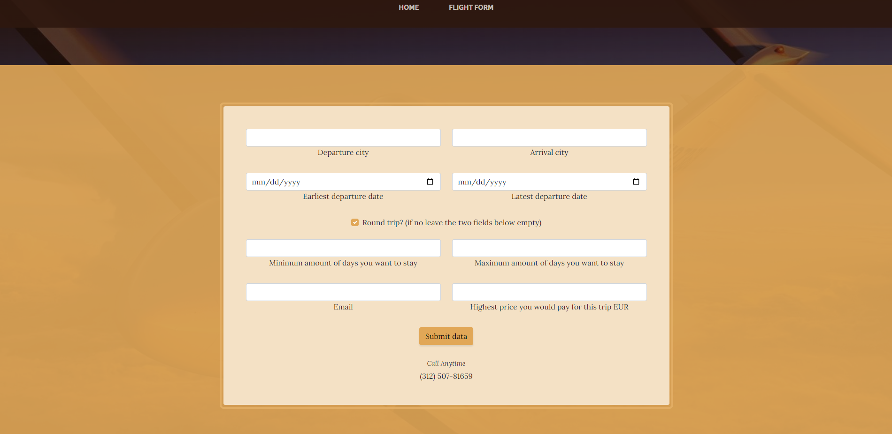
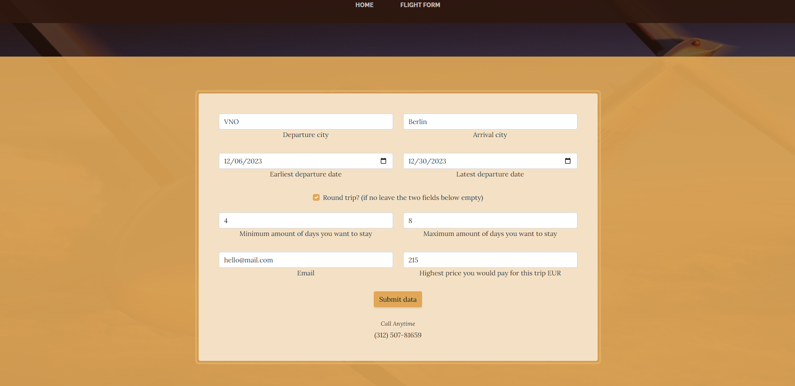
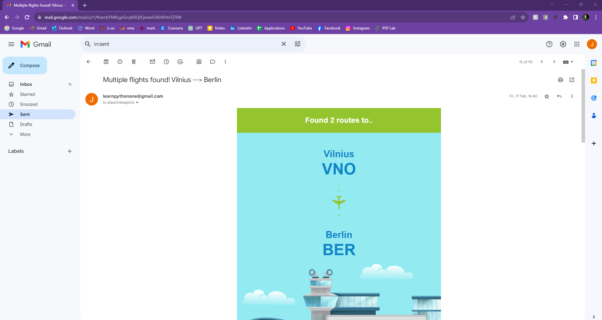
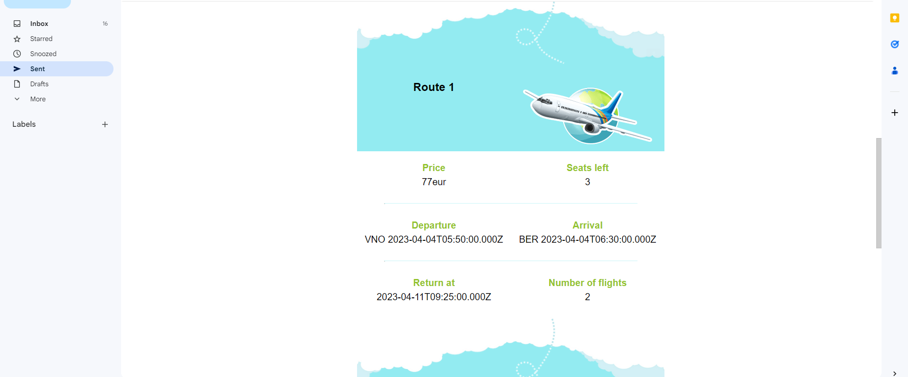
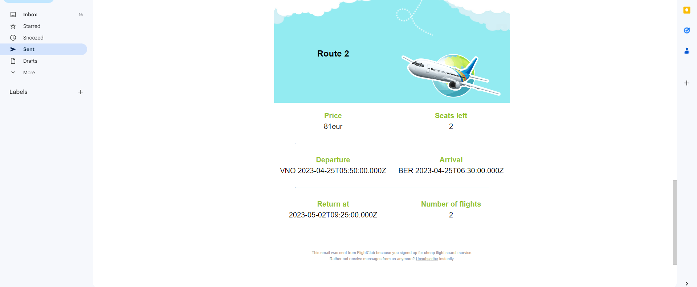

<h1>flight-club</h1>

<strong>Flight finder system created in early 2023.</strong>

<strong>This is not a real product! The project was created only for learning purposes.</strong>

<h2>How does it work?</h2>

<strong>Access home page from your browser</strong>

<strong>Navigate to flight form</strong>

<strong>Fill the flight form with your desired trip information and submit</strong>

<strong>System informs user by email after finding a cheap flight</strong>

<h2>Server explained</h2>

<strong>Standard scenario:</strong>

<ul>
    <li>Server receives the flight form, saves it into MySQL database.</li>
    <li>Server periodically makes API calls to a flight search provider.</li>
    <li>Sends user an email if the found flight is cheaper than the maximum price.</li>
</ul>

<strong>Other features:</strong>

<ul>
    <li>Most of the basic errors are handled, e.g., incorrect destinations, incorrect dates, etc.</li>
    <li>Email unsubscribe.</li>
    <li>Does not send similar flight offers (to previous flight offers).</li>
</ul>

<h2>Built with</h2>
<ul>
    <li>Python Flask</li>
    <li>MySQL</li>
    <li>GoogleCloud - for hosting</li>
    <li>HTML</li>
    <li>CSS</li>
</ul>

<strong>The project used to be hosted on GoogleCloud, but no longer is.</strong>

